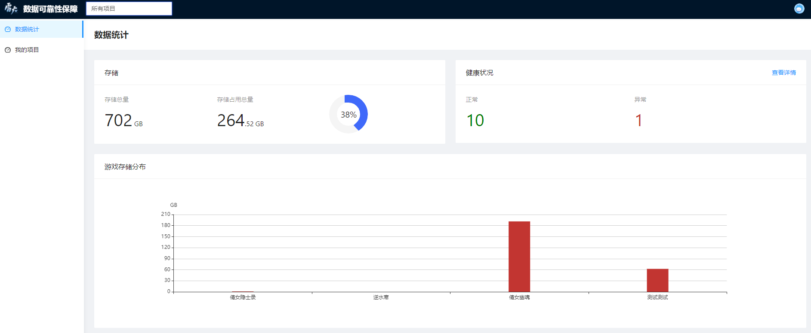

# 关于系统

- [系统简介](#系统简介)
- [功能模块简介](#功能模块简介)
  - [数据统计](#数据统计)
  - [备份策略](#备份策略)
  - [我的项目](#我的项目)
- [联系我们](#联系我们)

## 系统简介

雷火数据可靠性保障系统是由网易伏羲研发的数据备份和数据安全保障系统。系统提供了通用的数据备份流程和多种数据安全保障功能。在完成数据备份后，您还可以通过统计报表来观察数据备份情况。

## 功能模块简介

首先向您简要介绍雷火数据可靠性保障系统的各个功能模块，以便让您从整体上了解系统的各项能力和操作入口。 进入雷火数据可靠性保障系统，首先看到的是已备份数据的统计情况，如果页面提示“无查看权限”，请联系@房海群（fanghaiqun@corp.netease.com）开通系统权限。

### 数据统计

在**数据统计**模块，您可以通过多样化的数字和图表查看所有项目或单个项目的数据备份和数据安全统计情况。

### 备份策略

在**备份策略**模块，您可以根据自身需求创建和配置数据备份策略，从而更好地备份和校验数据。

### 我的项目

系统功能基于项目实现和使用，**我的项目**模块用于创建和管理您的一个或多个游戏项目。

### 联系我们

在产品使用过程中，如有任何反馈和建议，欢迎联系我们： 

- 产品负责人：刘思彦（gzliusiyan@corp.netease.com）；张树贵（zhangshugui@corp.netease.com）