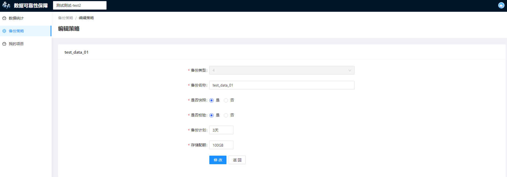

# 备份策略

 在**备份策略**模块，您可以根据自身需求创建和配置数据备份策略，从而更好地备份和校验数据

- [备份策略列表](#备份策略列表)
- [备份策略详情](#备份策略详情)
- [新建备份策略](#新建备份策略)
- [编辑备份策略](#编辑备份策略)
- [下载s3配置](#下载s3配置)
- [删除备份策略](#删除备份策略)

## 备份策略列表

点击左侧导航栏中的“备份策略”进入**备份策略**页，即可看到当前项目的备份策略列表。列表显示了包括备份策略名称、备份数据类型、备份数据子类型、存储配额和校验状态在内的备份策略基本信息，并提供了各项操作的入口。

## 备份策略详情

详情信息：点击列表操作项下的“详情”进入备份策略详情页，页面内将显示对应备份策略的各项具体信息，详情信息分为以下两类：

- 基本信息：显示当前备份策略的各项基本信息。如果您设置了备份有效期，还会进一步显示每个有效期规则的有效期时长和文件目录，以及用于创建有效期文件目录的s3cmd命令示例 
- aws信息：显示当前备份策略的各项aws信息，点击页面右上方的“更新key”可以更新access key和secret key。请注意更新key后，当前项目下其他备份策略的key也将更新 

## 新建备份策略

点击列表右上方位置的“新建备份策略”进入备份策略创建页面，待填项及说明如下：

- *备份策略名称：备份策略的名称，用于标识不同的备份策略
- *备份数据类型：该备份策略用于备份的数据的数据类型
- *备份数据子类型：基于“备份数据类型”选择的数据的子类型
- *备份计划：该备份策略计划进行数据备份的时间频率
- *存储配额：该备份策略的数据存储容量大小
- *是否校验：选择是否要对该备份策略下备份的数据做数据校验，
  - 选择“是”：请使用s3cmd命令备份文件数据，每次数据备份完成后，您可以将要校验的文件以“find <backup_dir/filename> -type f -print0 | xargs -0 md5sum | sort”命令生成md5并存入s3_sync_done文件内，随后系统会校验备份数据的md5是否与源数据一致，并将校验结果显示在备份策略列表的对应位置。此外，如果校验状态为“异常”，系统将向该备份策略对应的项目管理员发送告警邮件
  - 选择“否”：系统不会对您备份的数据进行校验，也不会显示校验状态
- 设置备份有效期：
  - 设置备份有效期需要首先设置有效期时长，填写有效期时长后，系统将自动填充这条有效期规则对应的 文件目录命名示例
  - 若设置备份有效期，请按照<备份有效期>/<服务器id>/<备份时间>(timestamp)的格式在存储桶中创建文件夹目录（ s3cmd sync LOCAL_DIR s3://BUCKET[/PREFIX] or s3://BUCKET[/PREFIX] LOCAL_DIR ），该目录下的数据会根据备份有效期进行定期删除。
  - 一个备份策略下可以创建多个备份有效期规则，点击输入框右侧的“添加”符号即可添加新的有效期规则

## 编辑备份策略

点击列表操作项下的“编辑”进入备份策略编辑页，编辑备份策略时不可更改“备份数据类型”和“备份数据子类型”两项参数，其余内容与“新建备份策略”一致。

## 下载s3配置

点击列表操作项下的“下载S3配置”来下载s3cmd对应的配置文件。您可以先安装s3cmd(sudo apt-get install s3cmd)，然后下载该文件并用来覆盖~/.s3cfg文件，即可使用s3cmd命令操作被分配的存储桶。

## 删除备份策略

点击列表操作项下的“删除”，可以删除掉不需要的备份策略。备份策略被删除后，其对应的存储桶，以及存储桶内备份的所有数据都将被删除。删除备份策略为危险动作，需要您进行二次确认。

