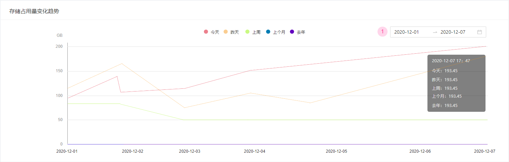

# 如何查看备份数据的统计情况

如果您已经创建了游戏项目，并完成了备份策略的配置和数据的备份，可以通过以下方式来查看已备份数据的指标统计情况：

- [针对所有项目的数据统计](#针对所有项目的数据统计)
- [针对单个项目的数据统计](#针对单个项目的数据统计)

## 针对所有项目的数据统计

在系统顶部导航中的项目筛选器中选择“所有项目”来查看针对所有项目的数据统计情况，具体内容包括：

- **存储情况**：您所管理的所有项目的数据存储占用总量、存储占比情况以及存储量的上周环比值

  

- **数据备份状态**：处于“正常”和“异常”两类数据备份状态的项目各自的数量，

  - 正常：备份计划正常执行、数据校验通过、备份数据完整    
  - 异常：当备份计划未正常执行、数据校验未通过或备份数据缺失其中一种情况出现时，归为异常状态

  

- **项目存储分布**：每个游戏项目的存储占用量分布统计柱状图，点击项目柱状图可以跳转至相应项目的数据统计页面

  

- **存储占用量变化趋势**：所有项目的数据存储占用量变化趋势折线图，

  - 统计维度：今天、昨天、上周、上个月和去年5个时间段
  - 日期选择：图表默认选择近7天数据，点击右上方日期选择框可以更换图表显示的时间区间

  

## 针对单个项目的数据统计

在系统顶部导航中的项目筛选器中选择某个项目来查看针对单个项目的数据统计情况，具体内容包括：

- **存储占用总量**：当前项目的数据存储占用总量和存储占比情况

- **数据备份状态**：

  - 正常：备份计划正常执行、数据校验通过、备份数据完整    
  - 异常：当备份计划未正常执行、数据校验未通过或备份数据缺失其中一种情况出现时，归为异常状态

- **存储占用量变化趋势**：单个项目的数据存储占用量变化趋势折线图，

  - 统计维度：今天、昨天、上周、上个月和去年5个时间段
  - 日期选择：图表默认选择近7天数据，点击右上方日期选择框可以更换图表显示的时间区间

  