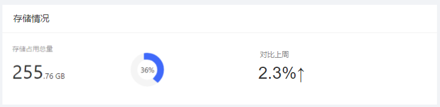
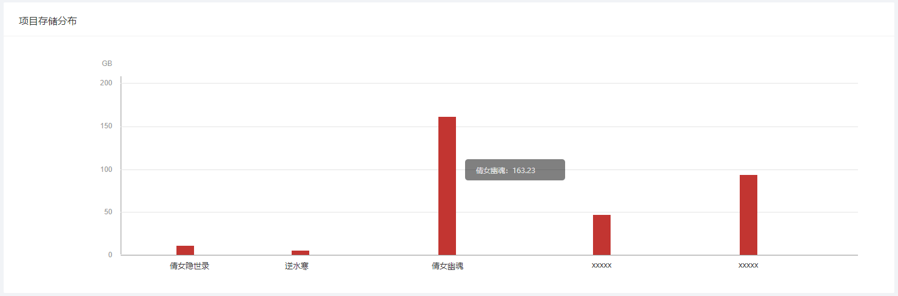
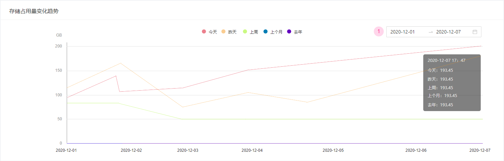
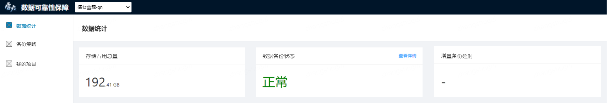

# 数据统计

 在**数据统计**模块，您可以通过多样化的数字和图表查看所有项目或单个项目的数据备份和数据安全统计情况：

- [数据统计-所有项目](#数据统计-所有项目)
- [数据统计-单个项目](#数据统计-单个项目)

## 数据统计-所有项目

在系统顶部导航中的项目筛选器中选择“所有项目”来查看针对您所管理的所有项目的数据统计情况，具体内容包括：

- **存储情况**：

  - 存储占用总量：所有项目已存储数据量之和
  - 存储占比情况：所有项目已存储数据占用总量占存储总配额的比例
  - 对比上周：存储占用总量与上周的环比值

  

- **数据备份状态**：处于“正常”和“异常”两类数据备份状态的项目各自的数量，

  - 正常：备份计划正常执行、数据校验通过、备份数据完整
  - 异常：当备份计划未正常执行、数据校验未通过或备份数据缺失其中一种情况出现时，归为异常状态
  - 详情：点击卡片右上方“查看详情”，可以通过弹窗来具体查看每个项目的数据备份状态

  

- **项目存储分布**：每个游戏项目的存储占用量分布统计柱状图，

  - 横坐标：游戏项目；纵坐标：数据存储占用量
  - 将光标悬浮至项目柱状图上方，系统将会显示该项目的具体数值
  - 点击项目柱状图可以跳转至相应项目的数据统计页面

  

- **存储占用量变化趋势**：所有项目的数据存储占用量变化趋势折线图，

  - 统计维度：今天、昨天、上周、上个月和去年5个时间段
  - 点击相应图注，可以切换具体折线的显示或隐藏状态
  - 将光标悬浮至折线图上方，系统将会显示该时间点的具体数值
  - 日期选择：图表默认选择近7天数据，点击右上方日期选择框可以更换图表显示的时间区间
  
  

## 数据统计-单个项目

在系统顶部导航中的项目筛选器中选择某个项目来查看针对单个项目的数据统计情况，具体内容包括：

- **存储占用总量**：当前项目的数据存储占用总量和存储占比情况

- **数据备份状态**：

  - 正常：备份计划正常执行、数据校验通过、备份数据完整    
  - 异常：当备份计划未正常执行、数据校验未通过或备份数据缺失其中一种情况出现时，归为异常状态
  - 详情：点击卡片右上方“查看详情”，可以通过弹窗来具体查看当前项目的数据备份状态

  

- **存储占用量变化趋势**：单个项目的数据存储占用量变化趋势折线图，

  - 统计维度：今天、昨天、上周、上个月和去年5个时间段
  - 日期选择：图表默认选择近7天数据，点击右上方日期选择框可以更换图表显示的时间区间

  