# 如何保障数据安全

完成基础的数据备份后，您可以通过以下操作来进一步保障数据的安全性：

- [执行备份计划](#执行备份计划)
- [遵循备份目录规则](#遵循备份目录规则)
- [进行数据校验](#进行数据校验)
- [检查备份数据完整性](#检查备份数据完整性)

## 执行备份计划

- **查看和修改备份计划**：在创建备份策略时指定的备份计划可以随时在备份策略列表中查看，建议您按照预设的备份计划进行数据备份。如果当前备份计划所对应的时间频率不再适用，您也可以通过操作项下的“编辑”来更改该备份策略下的备份计划

  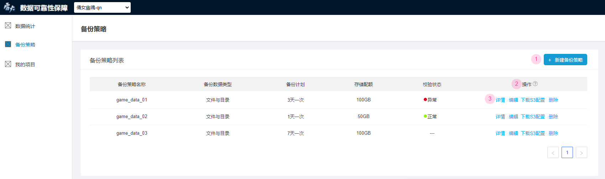

- **异常状态显示**：如果您没有按照备份计划对应的时间频率来进行数据备份，当前项目**数据统计**模块中的“数据备份状态”将会显示为“异常”

  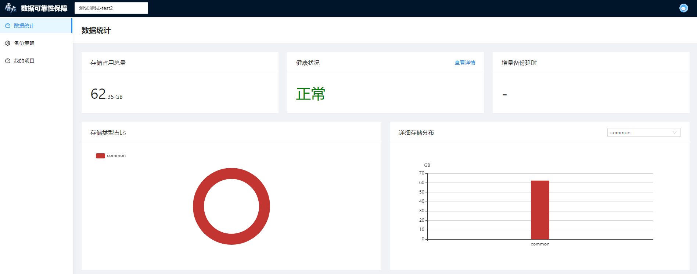
  
- **备份计划未执行告警邮件**：为了方便您定位备份计划存在的具体问题，系统会定期检查您是否正确执行备份计划，未正确执行时您将会收到系统发送的“备份计划未执行”的告警邮件，邮件内容如图所示：

  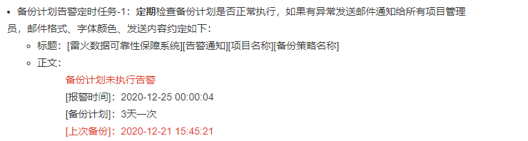

## 遵循备份目录规则

- **基础备份目录规则**： 一般情况下，您需要按照 <备份有效期>/<服务器id>/<备份时间>(timestamp) 的命名规则来创建备份数据的文件目录。如果备份目录命名有误，您所设置的备份数据有效期、备份服务器数据完整性检查等功能都将受到影响

- **特殊备份目录规则**：未设置备份有效期的备份策略不需要<备份有效期>目录，没有服务器id的游戏项目不需要<服务器id>目录

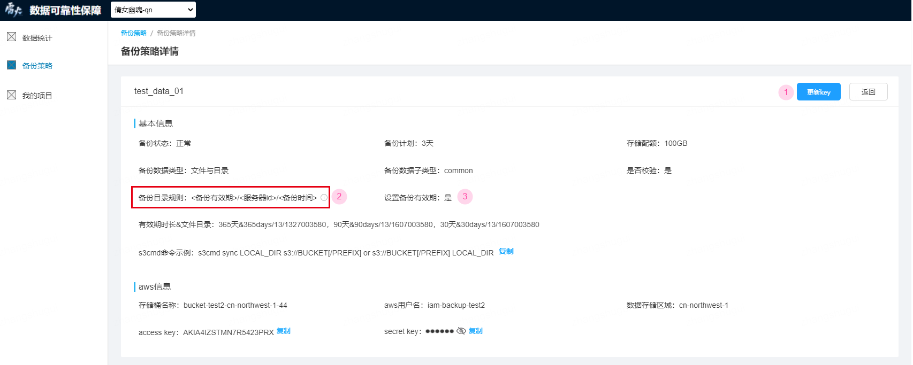

- **备份目录命名异常告警邮件**：为了方便您定位备份目录命名中存在的具体问题，系统会定期检查您是否正确命名备份目录，未正确命名时您将会收到系统发送的“备份目录命名异常”的告警邮件，邮件内容如图所示：

  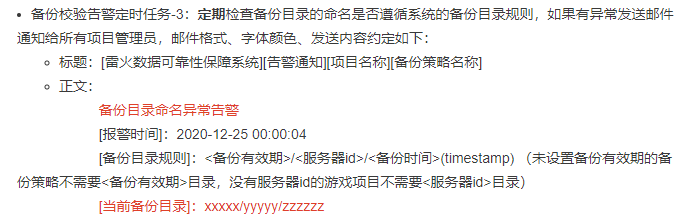

## 进行数据校验

- **开启数据校验选项**：如果您想对某个备份策略下备份的数据做数据校验，在创建该备份策略时需要在“是否校验”一项中选择“是”

  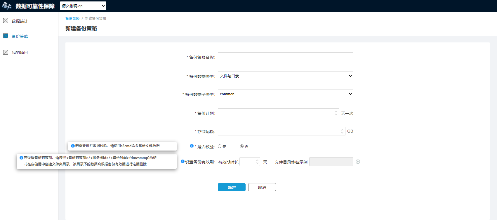

- **使用s3cmd命令校验数据**：开启数据校验选项后，如果需要校验备份数据与源数据是否一致，可以将要校验的文件以“find <backup_dir/filename> -type f -print0 | xargs -0 md5sum | sort”命令生成md5并存入上述s3_sync_done文件内，之后可以在系统内查看校验状态

  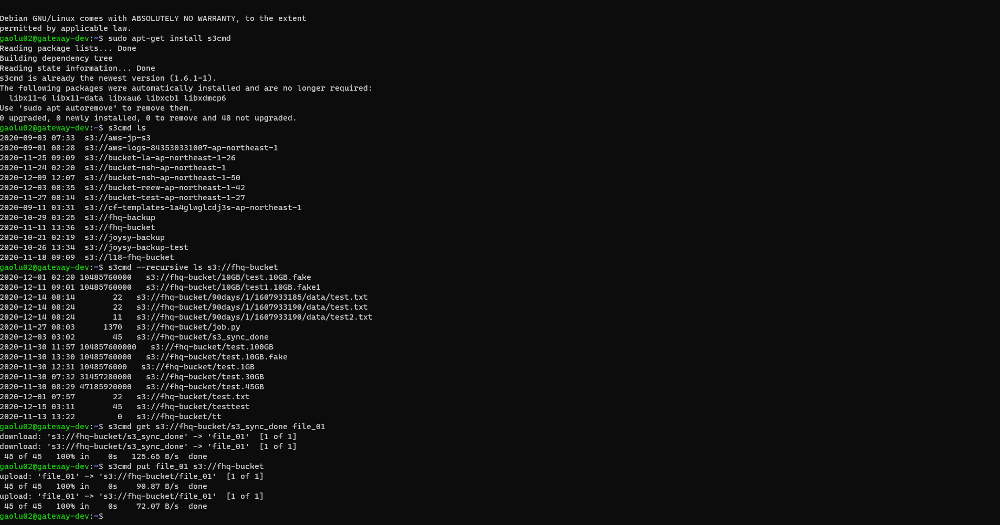

- **查看校验状态**：完成上述操作后，您可以在**备份策略**模块下的备份策略列表中查看相应备份策略的校验状态。“正常”表示该备份策略通过了最近一次的数据校验，“异常”则表示该备份策略未通过最近一次数据校验，可能存在备份数据与源数据不一致的问题

  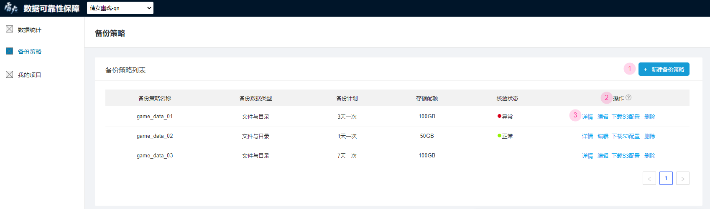

- **数据校验未通过告警邮件**：为了方便您定位数据校验中存在的具体问题，系统设置了数据校验告警的定时任务。若数据校验完成时您的备份数据存在异常，将会收到“备份校验未通过”的告警邮件，邮件内容如图所示：

  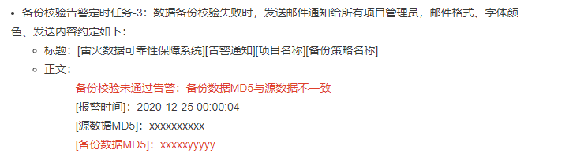

## 检查备份数据完整性

- **上传服务器id**：如果您想让系统定期检查备份数据中是否已包括所有服务器上的数据，首先需要在创建项目时正确填写“游戏服务器获取地址”参数来让系统获取该游戏项目下的所有服务器id

  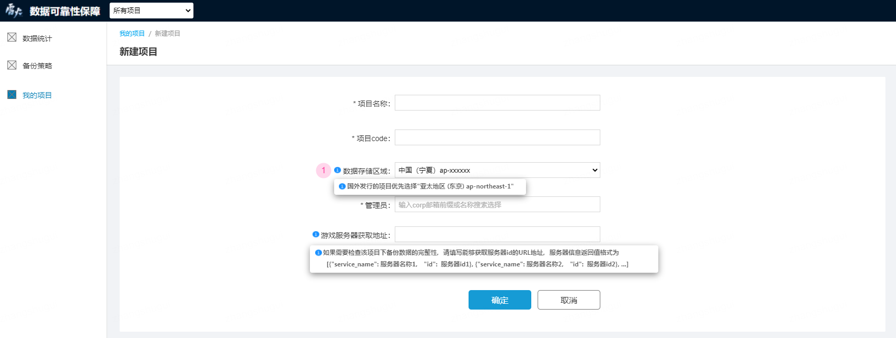

- **异常状态显示**：系统获取服务器id后，如果您备份的数据存在服务器id缺失，当前项目**数据统计**模块中的“数据备份状态”将会显示为“异常”

  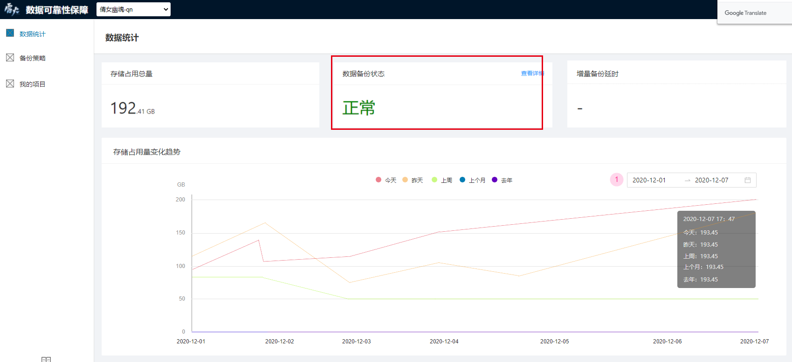

- **备份数据服务器id缺失告警邮件**：系统获取服务器id后，将会定期检查您所备份的数据是否完整，服务器id缺失时您将收到“备份数据服务器id缺失”的告警邮件，邮件内容如图所示：

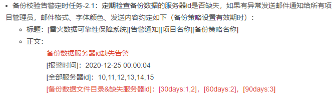