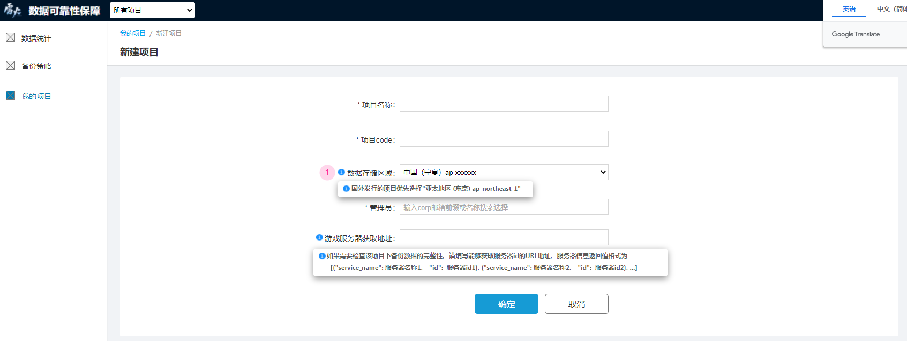
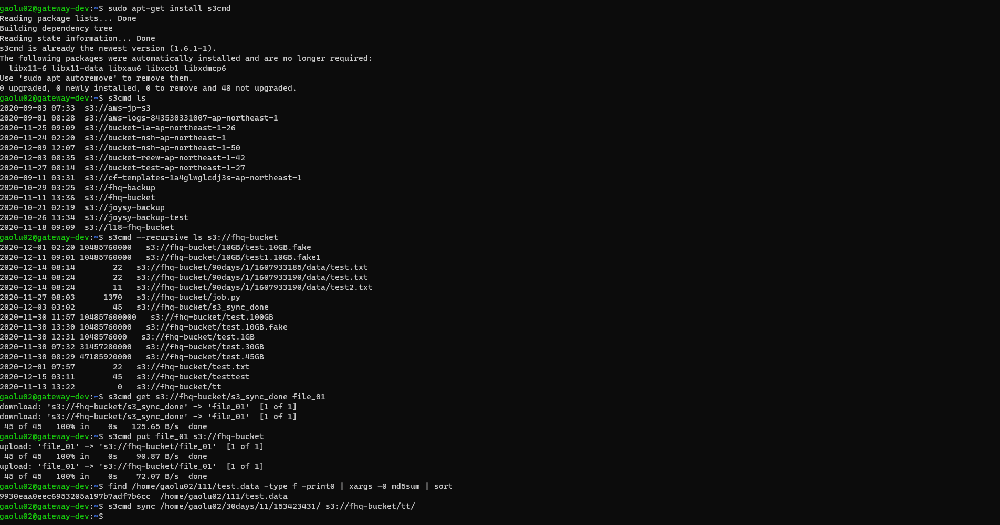
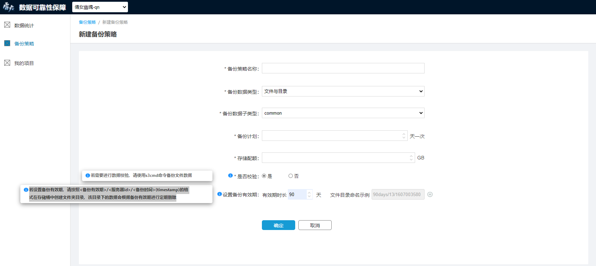
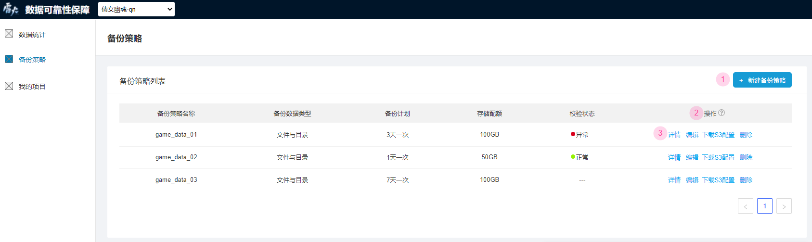
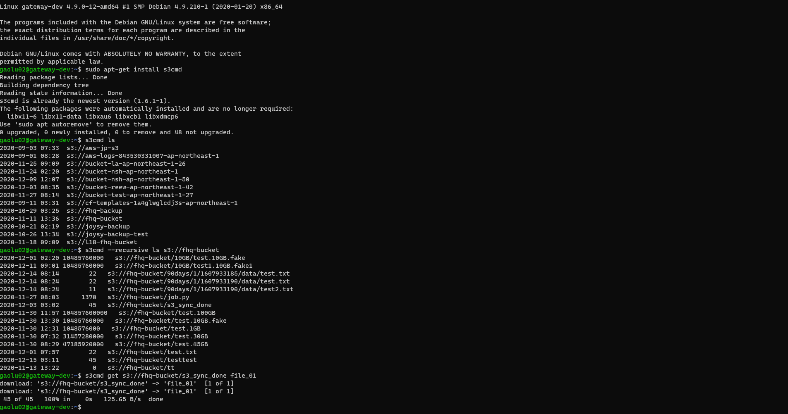

# 如何完成一次数据备份

数据备份是雷火数据可靠性保障系统所提供的核心功能之一，完成一次数据备份的必要步骤如下：

- [创建项目](#创建项目)
- [创建备份策略](#创建备份策略)
- [下载s3配置](#下载s3配置)
- [使用s3cmd命令备份数据](#使用s3cmd命令备份数据)

## 创建项目

雷火数据可靠性保障系统的功能是基于项目实现的，在使用系统的核心功能之前，您需要先在**我的项目**模块创建您的游戏项目。点击“新建项目”进入项目创建页面后，待填项及说明如下：

- *项目名称：游戏项目的名称
- *项目code：游戏项目的唯一标识
- *数据存储区域：您的备份数据在aws服务器中的存储区域。国内发行的项目请选择“中国 (宁夏) cn-northwest-1”；国外发行的项目优先选择“亚太地区 (东京) ap-northeast-1”
- *管理员：游戏项目的管理人员，系统的主要使用者之一，也是备份数据异常告警邮件的接收人
- 游戏服务器获取地址：如果需要检查该项目下备份数据的完整性，请填写能够获取服务器id的URL地址，服务器信息返回值格式为 [{"service_name": 服务器名称1， "id":  服务器id1}, {"service_name": 服务器名称2， "id":  服务器id2}, ...]

## 创建备份策略

项目创建完成后，您需要指定该项目下的数据备份策略。您可以同时拥有多个备份策略，每个备份策略对应一个aws数据存储桶。在**备份策略**模块中点击右上方的“新建备份策略”即可进入备份策略创建页面，待填项及说明如下：

- *备份策略名称：备份策略的名称，用于标识不同的备份策略
- *备份数据类型：该备份策略用于备份的数据的数据类型
- *备份数据子类型：基于“备份数据类型”选择的数据的子类型
- *备份计划：该备份策略计划进行数据备份的时间频率
- *存储配额：该备份策略的数据存储容量大小
- *是否校验：选择是否要对该备份策略下备份的数据做数据校验，
  - 选择“是”：请使用s3cmd命令备份文件数据，每次数据备份完成后，您可以将要校验的文件以“find <backup_dir/filename> -type f -print0 | xargs -0 md5sum | sort”命令生成md5并存入s3_sync_done文件内，随后系统会校验备份数据的md5是否与源数据一致，并将校验结果显示在备份策略列表的对应位置。此外，如果校验状态为“异常”，系统将向该备份策略对应的项目管理员发送告警邮件
  
    
  
  - 选择“否”：系统不会对您备份的数据进行校验，也不会显示校验状态
- 设置备份有效期：
  - 设置备份有效期需要首先设置有效期时长，填写有效期时长后，系统将自动填充这条有效期规则对应的 文件目录命名示例
  
  - 若设置备份有效期，请按照<备份有效期>/<服务器id>/<备份时间>(timestamp)的格式在存储桶中创建文件夹目录（ s3cmd sync LOCAL_DIR s3://BUCKET[/PREFIX] or s3://BUCKET[/PREFIX] LOCAL_DIR ），该目录下的数据会根据备份有效期进行定期删除
  
    
  
  - 一个备份策略下可以创建多个备份有效期规则，点击输入框右侧的“添加”符号即可添加新的有效期规则

## 下载S3配置

备份策略创建完成后，您可以在备份策略列表中看到这条备份策略。点击操作项下的“下载S3配置”来下载s3cmd对应的配置文件。您可以先安装s3cmd(sudo apt-get install s3cmd)，然后下载该文件并用来覆盖~/.s3cfg文件，即可使用s3cmd命令操作被分配的存储桶。

## 使用s3cmd命令备份数据

- 以上准备工作均已完成，通过s3cmd命令来备份您需要的数据即可。基础的备份目录规则为“<备份有效期>/<服务器id>/<备份时间>(timestamp)”，其中未设置备份有效期的备份策略不需要<备份有效期>目录，没有服务器id的游戏项目不需要<服务器id>目录

- 上传完要备份的数据之后，还需再上传一个以s3_sync_done命名的文件到备份文件的一级目录下，至此本次备份结束

