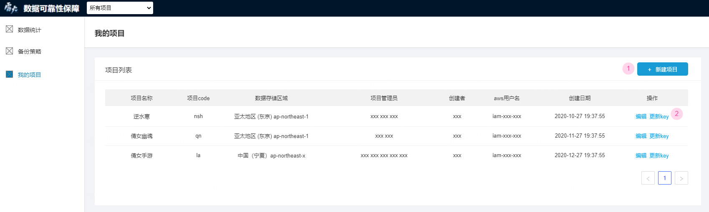
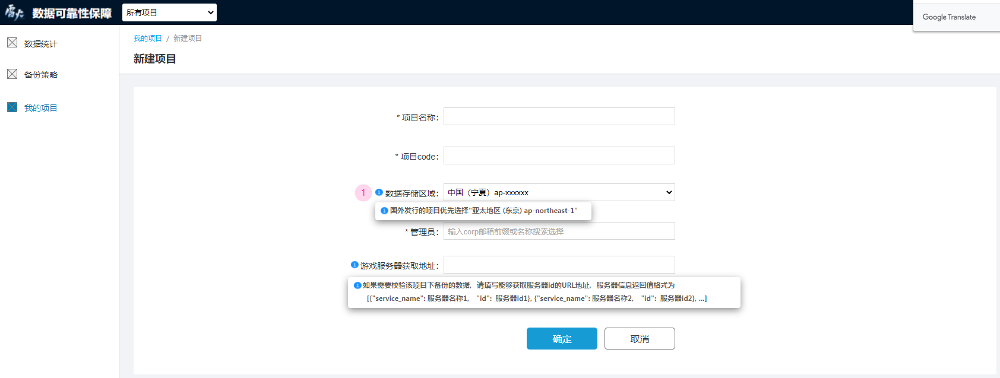
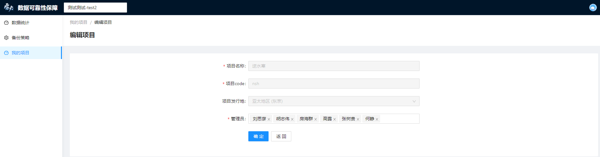
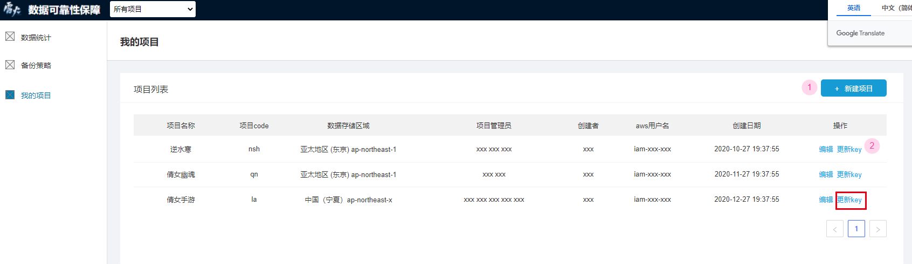

# 我的项目

 系统功能基于项目实现和使用，**我的项目**模块用于创建和管理您的一个或多个游戏项目：

- [项目列表](#项目列表)
- [新建项目](#新建项目)
- [编辑项目](#编辑项目)
- [更新key](#更新key)

## 项目列表

点击左侧导航栏中的“我的项目”进入**我的项目**页，页面内容为您所管理的所有项目的列表。列表显示了项目名称、项目code、数据存储区域、项目管理员、创建者和创建日期等项目基本信息，并提供了各项操作的入口。

## 新建项目

点击列表右上方位置的“新建项目”进入项目创建页面，待填项及说明如下：

- *项目名称：游戏项目的名称
- *项目code：游戏项目的唯一标识
- *数据存储区域：您的备份数据在aws服务器中的存储区域。国内发行的项目请选择“中国 (宁夏) cn-northwest-1”；国外发行的项目优先选择“亚太地区 (东京) ap-northeast-1”
- *管理员：游戏项目的管理人员，系统的主要使用者之一，也是备份数据告警邮件的接收人
- 游戏服务器获取地址：如果需要校验该项目下备份的数据，请填写能够获取服务器id的URL地址。服务器信息返回值格式为 [{"service_name": 服务器名称1， "id":  服务器id1}, {"service_name": 服务器名称2， "id":  服务器id2}, ...]

## 编辑项目

点击列表操作项下的“编辑”进入项目编辑页，编辑项目时支持更改“管理员”或“游戏服务器获取地址”。

## 更新key

点击列表操作项下的的“更新key”可以更新当前项目的access key和secret key， 更新后请前往备份策略详情页查看 。

